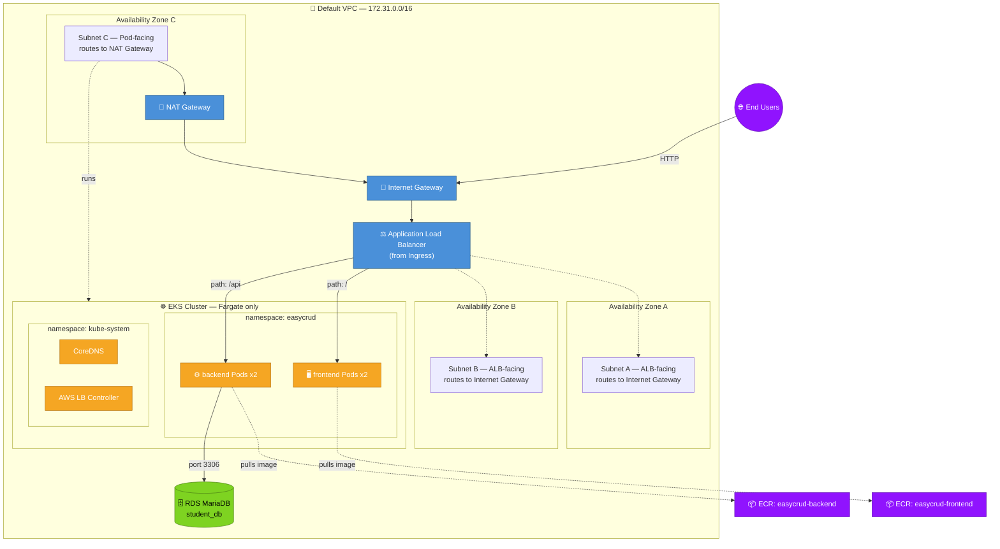
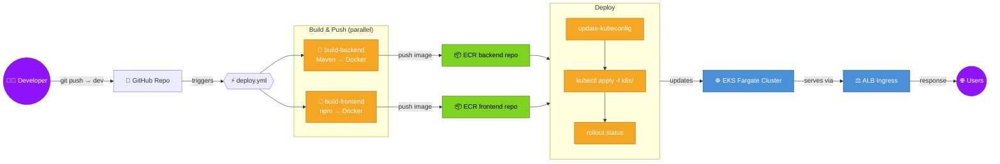

# 🚀 EasyCRUD — EKS Fargate Deployment Guide

A complete, from-scratch runbook for deploying this application to **Amazon EKS on Fargate** — no EC2 worker nodes, images in **Amazon ECR**, traffic routed through a single **ALB Ingress**, and builds/deploys fully automated by **GitHub Actions**.

> [!IMPORTANT]
> This guide intentionally uses your account's **Default VPC** for *everything* — the EKS cluster, the Fargate pods, and the RDS database all live in the **same VPC**. Keeping the database in the same VPC as the cluster is what makes pod-to-database networking simple and secure (a private security-group rule, no public exposure needed).

---

## 📐 Architecture

### Infrastructure



### CI/CD Workflow



> [!NOTE]
> The frontend calls a **relative** `/api` path (not a hardcoded backend URL), so both apps share one ALB / one origin. No CORS headaches, and no editing `.env` after every backend redeploy.

---

## 📂 Repository layout

| File | Purpose |
|---|---|
| `k8s/namespace.yaml` | Creates the `easycrud` namespace |
| `k8s/backend-deployment.yaml` | Backend Deployment, 2 replicas |
| `k8s/backend-service.yaml` | ClusterIP service for backend, port 8080 |
| `k8s/frontend-deployment.yaml` | Frontend Deployment, 2 replicas |
| `k8s/frontend-service.yaml` | ClusterIP service for frontend, port 80 |
| `k8s/ingress.yaml` | ALB Ingress — routes `/api` → backend, `/` → frontend |
| `.github/workflows/deploy.yml` | Builds both images, pushes to ECR, applies `k8s/`, waits for rollout |
| `frontend/.env` | `VITE_API_URL=/api` (relative, baked into the frontend build) |
| `backend/dockerfile` | Builds the Spring Boot jar with `-DskipTests` (tests need a live DB connection that CI runners can't reach — the image build doesn't need test execution) |
| `backend/src/main/resources/application.properties` | RDS endpoint + credentials — you configure this after Phase 4 |

---

## ✅ Prerequisites

- [ ] AWS account with console access
- [ ] This repo's `dev` branch is what you'll deploy from
- [ ] A GitHub account with push access to this repo
- [ ] A way to run a handful of `kubectl`/`aws`/`mysql` CLI commands — see below

> [!TIP]
> ### How to run the CLI commands in this guide
> A few steps in this guide need a command line, not just the AWS Console. You have two equally valid options — pick whichever you're more comfortable with, and use the same one throughout:
>
> **Option A — AWS CloudShell** (browser-based, no server to manage)
> Console → click the CloudShell icon (top navigation bar). It comes with the AWS CLI pre-installed. Plain CloudShell can run every `kubectl`/`helm`/`aws` command in this guide, **except** the one step that talks directly to the database (Phase 8) — for that one step specifically, use **Actions → Create VPC environment** (select your Default VPC and the Pod subnet from Phase 3) so CloudShell can reach RDS's private address.
> *Note: CloudShell VPC environments require your AWS account to have completed standard verification — brand-new accounts can occasionally see a short delay before this feature is available. If that happens, use Option B for Phase 8 instead.*
>
> **Option B — A temporary EC2 instance**
> Launch a small instance (e.g., `t3.micro`, Amazon Linux 2023) into the **Pod subnet** from Phase 3 — it'll have internet access via the NAT Gateway and can also reach RDS directly (same VPC). Install what you need on it (`aws configure` with your credentials, `kubectl`, `helm`, the `mariadb` client). This instance is **not** part of the running architecture — it's a one-time bootstrap tool. Terminate it once you're done; nothing in the deployed app depends on it.

---

## Phase 1 — Amazon ECR: create your image repositories

1. Console → **ECR** → **Repositories** → **Create repository**.
2. Visibility: **Private**. Name: `easycrud-backend`. Leave the rest at defaults → **Create repository**.
3. Repeat with name `easycrud-frontend`.
4. Note your **AWS Account ID** (top-right account menu) and your **region** (e.g. `ap-south-1`) — you'll need both repeatedly.

- [ ] `easycrud-backend` repo created
- [ ] `easycrud-frontend` repo created
- [ ] Account ID and region noted

---

## Phase 2 — Prepare the Default VPC

You're using your account's existing **Default VPC** — no new VPC is created. One AWS platform rule shapes this phase: **EKS Fargate profiles only accept subnets that have no direct route to an Internet Gateway** (and Fargate pods are never assigned a public IP regardless). So one of your subnets needs a route through a **NAT Gateway** instead of straight to the internet — that's the only change we make to the Default VPC; everything else stays exactly as it is.

1. Console → **VPC** → **Your VPCs** → the one marked **Default VPC: Yes** → note its **VPC ID** and **IPv4 CIDR** (typically `172.31.0.0/16`).
2. **Subnets** → filter by that VPC ID. You'll see one subnet per Availability Zone. Choose:
   - **2 subnets** (different AZs) → keep these untouched → these are your **ALB subnets**
   - **1 subnet** (a third AZ) → this becomes your **Pod subnet**
   - Note all 3 subnet IDs.
3. **Elastic IPs** → **Allocate Elastic IP address** → defaults are fine → **Allocate**.
4. **NAT Gateways** → **Create NAT gateway**:
   - Subnet: one of your **ALB subnets** (it needs the Internet Gateway route)
   - Elastic IP allocation: the one from step 3
   - **Create NAT gateway** → wait for status **Available**
5. **Route Tables** → **Create route table**:
   - Name: `easycrud-pod-rt`, VPC: your Default VPC → **Create**
   - Open it → **Routes** → **Edit routes** → **Add route** → Destination `0.0.0.0/0` → Target = your NAT Gateway → **Save**
   - **Subnet associations** → **Edit subnet associations** → check your **Pod subnet only** → **Save**
6. Tag the subnets (Subnets page → select → **Tags** → **Manage tags**):
   - Both **ALB subnets** → `kubernetes.io/role/elb` = `1`
   - The **Pod subnet** → `kubernetes.io/role/internal-elb` = `1`

- [ ] Default VPC ID and CIDR noted
- [ ] 2 ALB subnet IDs + 1 Pod subnet ID noted
- [ ] NAT Gateway `Available`
- [ ] `easycrud-pod-rt` created, routes `0.0.0.0/0` to the NAT Gateway, associated with the Pod subnet only
- [ ] Subnets tagged

> [!NOTE]
> **Cost:** a NAT Gateway runs about $0.045/hr (~$32/month) plus a small per-GB data charge — this is the only recurring cost this networking setup adds beyond EKS, RDS, and the ALB itself.

---

## Phase 3 — Amazon RDS: the database, in the same VPC

Keeping RDS in the same VPC as the cluster means pod-to-database traffic never leaves your VPC — no public exposure, no cross-VPC routing to worry about.

1. Console → **RDS** → **Create database**.
2. Engine: **MariaDB**. Templates: **Free tier** (if eligible) or **Dev/Test**.
3. Settings: DB instance identifier (e.g. `easycrud-db`), master username `admin`, set and record a master password.
4. **Connectivity**:
   - **Virtual Private Cloud (VPC)**: select your **Default VPC** (the same one from Phase 2) — this is the critical setting.
   - **DB subnet group** → **Create new DB subnet group** → it will include your VPC's subnets automatically (all 3 — RDS needs subnets in ≥2 AZs regardless of which one it actually places the instance in).
   - **Public access**: **No**. There's no need to expose this database to the internet at all — everything that needs to reach it (your app, and you during setup) is inside this same VPC.
   - **VPC security group**: **Create new** → name it `easycrud-rds-sg`.
5. Leave the rest at defaults → **Create database**. Wait for status **Available** (~5-10 minutes).
6. Once available, open `easycrud-rds-sg` → **Edit inbound rules** → **Add rule**:
   - Type: **MySQL/Aurora** (port 3306)
   - Source: **Custom** → your Default VPC's CIDR (e.g. `172.31.0.0/16`)
   - **Save rules**
7. Note the instance's **Endpoint** (Connectivity & security tab) — you'll need it for `application.properties`.

- [ ] RDS instance `Available`, in the Default VPC, **not** publicly accessible
- [ ] Security group allows 3306 from the VPC CIDR
- [ ] Endpoint noted

---

## Phase 4 — Create `student_db`

Using your CLI environment from the tip above (CloudShell-with-VPC-environment, or your temporary EC2 instance):

```sh
# Install a MariaDB/MySQL client if you don't already have one
sudo yum install -y mariadb105   # Amazon Linux
# or: sudo apt-get install -y mariadb-client   # Ubuntu

mysql -h <your-rds-endpoint> -u admin -p
```
At the prompt:
```sql
CREATE DATABASE student_db;
EXIT;
```

> [!NOTE]
> You don't need to create the `students` table by hand. `backend/src/main/resources/application.properties` sets `spring.jpa.hibernate.ddl-auto=update`, so Hibernate creates the table automatically the first time the backend pod starts successfully.

Now update `application.properties` with this RDS endpoint, username, and password, then commit and push to `dev`:
```sh
git add backend/src/main/resources/application.properties
git commit -m "Configure RDS connection for deployment"
git push origin dev
```

- [ ] `student_db` database created
- [ ] `application.properties` updated, committed, and pushed

---

## Phase 5 — IAM roles and the GitHub Actions user

IAM console → **Roles** → **Create role**, twice:

**a) EKS cluster role**
- Trusted entity: AWS service → **EKS** → **EKS - Cluster**
- Attach: `AmazonEKSClusterPolicy`
- Name: `easycrud-eks-cluster-role`

**b) Fargate pod execution role**
- Trusted entity: AWS service → **EKS** → **EKS - Fargate pod**
- Attach: `AmazonEKSFargatePodExecutionRolePolicy`
- Name: `easycrud-eks-fargate-role`

**c) GitHub Actions deployer (IAM user)**
- IAM → **Users** → **Create user** → name `github-actions-deployer` → no console access
- Open the user → **Permissions** → **Add permissions** → **Create inline policy** → **JSON**:
  ```json
  {
    "Version": "2012-10-17",
    "Statement": [
      { "Effect": "Allow", "Action": ["ecr:GetAuthorizationToken"], "Resource": "*" },
      { "Effect": "Allow", "Action": [
          "ecr:BatchCheckLayerAvailability","ecr:GetDownloadUrlForLayer",
          "ecr:BatchGetImage","ecr:PutImage","ecr:InitiateLayerUpload",
          "ecr:UploadLayerPart","ecr:CompleteLayerUpload"
        ], "Resource": "arn:aws:ecr:*:ACCOUNT_ID:repository/easycrud-*" },
      { "Effect": "Allow", "Action": ["eks:DescribeCluster"], "Resource": "*" }
    ]
  }
  ```
  (replace `ACCOUNT_ID`) → name it `easycrud-deployer-policy` → **Create policy**
- **Security credentials** tab → **Create access key** → "Application running outside AWS" → **save both values now** (the secret is never shown again)

- [ ] `easycrud-eks-cluster-role` created
- [ ] `easycrud-eks-fargate-role` created
- [ ] `github-actions-deployer` user created, policy attached, access key saved

---

## Phase 6 — Create the EKS cluster

1. Console → **EKS** → **Clusters** → **Create cluster**.
2. Name: `easycrud-cluster`. Kubernetes version: latest available. Cluster service role: `easycrud-eks-cluster-role`.
3. **Networking**: VPC = your Default VPC; subnets = **all 3** from Phase 2 (2 ALB subnets + the Pod subnet). Cluster endpoint access: **Public and private**.
4. Leave add-ons at their defaults (CoreDNS, kube-proxy, VPC CNI) → **Create**.
5. Wait for status **Active** (~10-15 minutes).

- [ ] Cluster status: `Active`

---

## Phase 7 — Fargate profile and migrating CoreDNS

A single Fargate profile can hold multiple **pod selectors**, so one profile covers both your app and the system pods:

1. Cluster → **Compute** tab → **Add Fargate profile**.
2. Name: `easycrud-fargate-profile`. Pod execution role: `easycrud-eks-fargate-role`. Subnets: your **Pod subnet only**.
3. **Pod selectors** → add two:
   - Selector 1 — Namespace: `easycrud` (no labels)
   - Selector 2 — Namespace: `kube-system` (no labels)
4. **Create** → wait for **Active**.

Because CoreDNS is deployed automatically the moment the cluster is created — before this Fargate profile exists — its pods start out unschedulable (there are no EC2 nodes, and no Fargate profile existed yet to claim them). Two small fixes, run from your CLI environment:

```sh
aws eks update-kubeconfig --name easycrud-cluster --region ap-south-1

# Remove the "EC2 only" hint so CoreDNS is eligible for Fargate
kubectl patch deployment coredns -n kube-system --type json \
  -p='[{"op": "remove", "path": "/spec/template/metadata/annotations/eks.amazonaws.com~1compute-type"}]'

# Recreate the pods so they're picked up by the now-existing Fargate profile
kubectl delete pod -n kube-system -l k8s-app=kube-dns
```

Verify:
```sh
kubectl get pods -n kube-system
```
CoreDNS's 2 pods should reach `Running` within a minute or two (Fargate pods take a bit longer to start than normal pods — each one boots its own micro-VM).

- [ ] `easycrud-fargate-profile` created with both selectors, `Active`
- [ ] CoreDNS annotation patched and pods recreated
- [ ] `kubectl get pods -n kube-system` shows CoreDNS `Running`

---

## Phase 8 — Grant cluster access (EKS Access Entries)

Cluster → **Access** tab → **Create access entry**, twice:

1. Principal: **your own IAM user** → Type: Standard → Policy: `AmazonEKSClusterAdminPolicy` → Scope: cluster-wide → **Create**.
   *(Skip this one if you're using your account's root user or an IAM user that created the cluster — EKS grants the cluster creator implicit admin access automatically.)*
2. Principal: `github-actions-deployer` → Type: Standard → Policy: `AmazonEKSClusterAdminPolicy` → Scope: cluster-wide → **Create**.

> [!TIP]
> If step 2 fails right after creating the IAM user in Phase 5, wait ~15 seconds and retry — brand-new IAM identities can take a moment to propagate.

- [ ] Your own access entry exists (or you confirmed implicit creator access)
- [ ] `github-actions-deployer` access entry created

---

## Phase 9 — AWS Load Balancer Controller

This is what turns your `Ingress` resource into a real, working Application Load Balancer.

1. Cluster → **Overview** tab → copy the **OpenID Connect provider URL**.
2. IAM → **Identity providers** → **Add provider** → Type: **OpenID Connect** → paste the URL → **Get thumbprint** → Audience: `sts.amazonaws.com` → **Add provider**.
3. IAM → **Policies** → **Create policy** → **JSON** tab → paste the contents of:
   `https://raw.githubusercontent.com/kubernetes-sigs/aws-load-balancer-controller/v2.9.0/docs/install/iam_policy.json`
   → name it `AWSLoadBalancerControllerIAMPolicy`.
4. IAM → **Roles** → **Create role** → Trusted entity: **Web identity** → Identity provider = the one from step 2 → Audience: `sts.amazonaws.com` → attach `AWSLoadBalancerControllerIAMPolicy` → name it `AmazonEKSLoadBalancerControllerRole`.
5. Open that role → **Trust relationships** → **Edit trust policy** → replace the `Condition` block so it scopes to exactly this service account (replace `YOUR_OIDC_ID` with the ID from your provider URL):
   ```json
   "Condition": {
     "StringEquals": {
       "oidc.eks.ap-south-1.amazonaws.com/id/YOUR_OIDC_ID:aud": "sts.amazonaws.com",
       "oidc.eks.ap-south-1.amazonaws.com/id/YOUR_OIDC_ID:sub": "system:serviceaccount:kube-system:aws-load-balancer-controller"
     }
   }
   ```
   → **Update policy**.

Now install the controller via Helm, from your CLI environment:

```sh
# Install Helm if you don't have it
curl -fsSL -o get_helm.sh https://raw.githubusercontent.com/helm/helm/main/scripts/get-helm-3
chmod +x get_helm.sh && ./get_helm.sh

helm repo add eks https://aws.github.io/eks-charts
helm repo update

helm install aws-load-balancer-controller eks/aws-load-balancer-controller \
  -n kube-system \
  --set clusterName=easycrud-cluster \
  --set region=ap-south-1 \
  --set vpcId=<your-default-vpc-id> \
  --set serviceAccount.create=true \
  --set serviceAccount.name=aws-load-balancer-controller \
  --set serviceAccount.annotations."eks\.amazonaws\.com/role-arn"="arn:aws:iam::ACCOUNT_ID:role/AmazonEKSLoadBalancerControllerRole"
```

Verify:
```sh
kubectl get pods -n kube-system | grep aws-load-balancer-controller
```
Both pods should reach `Running`.

- [ ] IAM OIDC identity provider added
- [ ] `AWSLoadBalancerControllerIAMPolicy` created
- [ ] `AmazonEKSLoadBalancerControllerRole` created, trust policy scoped to the controller's service account
- [ ] Controller installed, both pods `Running`

---

## Phase 10 — GitHub Secrets

Repo on GitHub → **Settings → Secrets and variables → Actions → New repository secret**:

| Secret name | Value |
|---|---|
| `AWS_ACCESS_KEY_ID` | from Phase 5c |
| `AWS_SECRET_ACCESS_KEY` | from Phase 5c |
| `AWS_REGION` | e.g. `ap-south-1` |
| `AWS_ACCOUNT_ID` | your 12-digit account ID |
| `EKS_CLUSTER_NAME` | `easycrud-cluster` |

- [ ] All 5 secrets added

---

## Phase 11 — Deploy

Push to `dev` (or merge a change into it) to trigger `.github/workflows/deploy.yml`:

1. GitHub repo → **Actions** tab → watch the run: `build-backend` and `build-frontend` run in parallel (build + push images to ECR), then `deploy` applies everything in `k8s/` and waits for rollout.
2. Once green, get your app's public address from your CLI environment:
   ```sh
   kubectl get ingress easycrud-ingress -n easycrud
   ```
   Give the ALB a minute or two to provision — the `ADDRESS` column starts empty, then fills in with something like `xxxxxxxx.ap-south-1.elb.amazonaws.com`.
3. Open that address in a browser. The frontend loads at `/`; its calls to `/api/...` route through the same ALB to the backend.

- [ ] GitHub Actions run green
- [ ] `kubectl get ingress` shows an `ADDRESS`
- [ ] App loads in browser; registering/listing/deleting a student works end to end

---

## 🔧 Troubleshooting

| Symptom | Likely cause | Fix |
|---|---|---|
| Pods stuck `Pending` | Fargate profile selector doesn't match the pod's namespace, or missing `resources.requests` | `kubectl describe pod <name> -n <ns>` and check the Events section |
| Pods created *before* a matching Fargate profile existed stay `Pending` forever | Fargate's scheduling webhook only intercepts pods at creation time | `kubectl delete pod <name> -n <ns>` — the Deployment/ReplicaSet recreates it, this time correctly picked up by Fargate |
| `ErrImagePull` / `ImagePullBackOff` | Wrong `AWS_ACCOUNT_ID`/`AWS_REGION`, or the pod landed in a subnet with no route to the internet | Confirm the GitHub secrets, and confirm the pod is scheduled in the Pod subnet (which has the NAT Gateway route) |
| Backend `CrashLoopBackOff` with a Hibernate "Unable to determine Dialect" error | The pod can't reach RDS at all | Confirm RDS's security group allows 3306 from the VPC CIDR, and that RDS is in the **same VPC** as the cluster |
| `502 Bad Gateway` from the ALB | No healthy targets — usually the backend pod is crashing (see above) | Check `kubectl get pods -n easycrud` and the pod's logs |
| Ingress has no `ADDRESS` | ALB Controller isn't running, or its IAM role/OIDC trust is misconfigured | `kubectl get pods -n kube-system` for the controller; `kubectl describe ingress easycrud-ingress -n easycrud` for events |
| GitHub Actions fails on `kubectl apply`/`update-kubeconfig` | `github-actions-deployer` is missing its EKS access entry, or a GitHub secret is wrong | Re-check Phase 8 and Phase 10 |
| Docker build fails during `mvn clean package` | The test suite tries to boot a full Spring context requiring a live DB connection, which CI runners can't reach | Already handled — `backend/dockerfile` builds with `-DskipTests` |

---

## 🧹 Cleaning up

To tear this down and stop all charges, delete in this order:

1. `kubectl delete -f k8s/` (removes the Ingress first, so AWS deletes the ALB)
2. Uninstall the controller: `helm uninstall aws-load-balancer-controller -n kube-system`
3. Delete the Fargate profile, then the EKS cluster
4. Delete the NAT Gateway, release its Elastic IP, delete the `easycrud-pod-rt` route table (the Default VPC and its subnets stay — you only added these on top of it)
5. Delete the ECR repositories (or just their images)
6. Delete the RDS instance and its DB subnet group
7. Delete the IAM roles, policies, identity provider, and the `github-actions-deployer` user

---

## 🔒 Security notes for going beyond a learning deployment

- RDS's security group in this guide is scoped to the VPC CIDR, not to a specific subnet — tightening it to just the Pod subnet's CIDR is a reasonable next step.
- `application.properties` holds the DB password in plaintext in the repo. For anything beyond a personal project, move it to a Kubernetes Secret or AWS Secrets Manager instead of committing it.
- `github-actions-deployer`'s access key is a long-lived credential. A GitHub OIDC → IAM role trust (no stored keys at all) is a stronger long-term setup than static access keys in GitHub Secrets.
